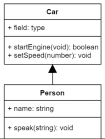
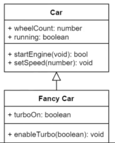
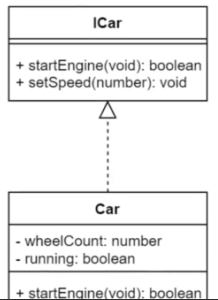

# UML Diagrams

- [UML Diagrams](#uml-diagrams)
  - [UML relations](#uml-relations)
    - [Directed Association](#directed-association)
    - [Extends/Inherits](#extendsinherits)
    - [Implements](#implements)

## UML relations

### Directed Association

Person use Car.

### Extends/Inherits

Fancy car extends Car.

### Implements

Car implements ICar.
