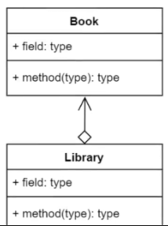
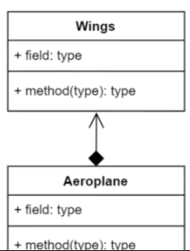
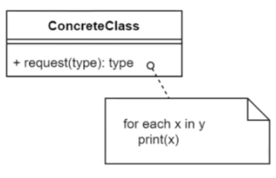

# UML Diagrams

- [UML Diagrams](#uml-diagrams)
  - [UML relations](#uml-relations)
    - [Directed Association](#directed-association)
    - [Extends/Inherits](#extendsinherits)
    - [Implements](#implements)
    - [Aggregats](#aggregats)
    - [Composition](#composition)
    - [Pseudocode Annotation](#pseudocode-annotation)

## UML relations

### Directed Association

Person use Car.

### Extends/Inherits

Fancy car extends Car.

### Implements

Car implements ICar.

### Aggregats

Library aggregats Book.

### Composition

Aeroplane is composed of Wings.

### Pseudocode Annotation

pseudocode is a plain language description of the steps in an algorithm and used to portray a concept without needing to write long lines of code.
